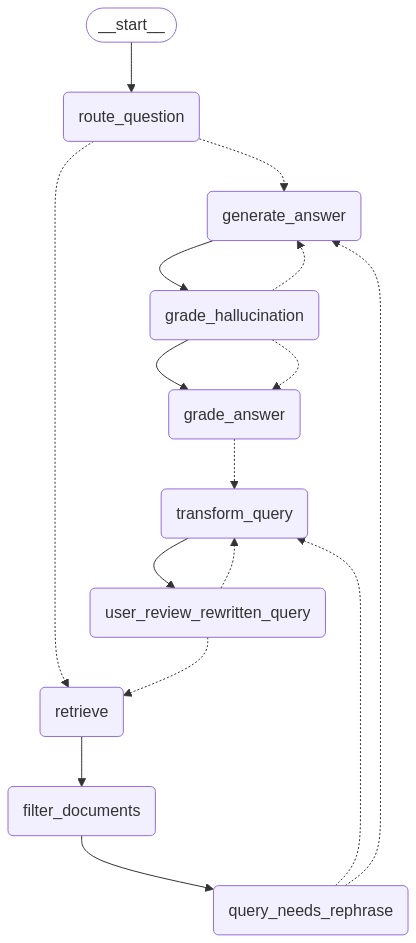

# SH RAG Chat

# SH-RAG-Chat

A Python-based RAG (Retrieval-Augmented Generation) chat application with FastAPI backend and authentication support.

## Project Overview

This project implements a chat application with RAG capabilities, using LanceDB for vector storage and FastAPI for the backend API. The application includes user authentication, CLI tools, and a modern UI interface.

## Project Structure
```
api/
├── core/                  # Core RAG pipeline components
│   ├── rag_pipeline.py    # Main RAG implementation
│   ├── rag_states.py      # State management for RAG
│   ├── lance_retriever.py # LanceDB retriever implementation
│   └── bento_embeddings.py # BentoML embeddings
├── ui/                    # Streamlit UI components
│   ├── app.py             # Main Streamlit application
│   └── components/        # UI components
│       ├── chat.py        # Chat interface
│       ├── feedback.py    # Feedback collection
│       └── debug.py       # Debug interface
├── utils/                 # Utility functions
│   ├── stream_response.py # Streaming response utilities
│   ├── logging.py         # Logging configuration
│   ├── config.py          # Configuration management
│   └── file_rendering.py  # File rendering utilities
├── cli/                   # Command-line tools
│   └── create_user.py     # User creation utility
├── conf/                  # Configuration files
│   ├── conf.yaml          # Main configuration
│   ├── chat.yaml          # Chat configuration
│   └── local/             # Local configuration (not in git)
├── lancedb/               # LanceDB storage
├── logs/                  # Application logs
├── tests/                 # Test suite
├── main.py                # FastAPI application entry point
├── auth.py                # Authentication logic
├── models.py              # Data models
├── pyproject.toml         # Project dependencies and configuration
├── setup_lancedb.py       # LanceDB setup script
├── run.ps1/run.sh         # Run scripts
└── lance_db.ps1           # LanceDB management script
```

## Langchain Graph



## Features

- User Authentication and Authorization
- RAG-based Chat Interface
- Vector Storage with LanceDB
- FastAPI Backend
- CLI Tools for User Management
- Modern UI Components
- Comprehensive Testing Suite

## Technical Stack

- **Backend Framework**: FastAPI
- **Database**: SQLite (via SQLModel)
- **Vector Storage**: LanceDB
- **Authentication**: JWT-based
- **Development Tools**:
  - UV (Package Manager)
  - Ruff (Linter)
  - Pyright (Type Checker)

## Installation

1. Clone the repository:
```bash
git clone https://github.com/yourusername/sh-rag-chat.git
cd sh-rag-chat
```

2. Set up the Python environment:
```bash
# Using UV package manager
uv venv
source .venv/bin/activate  # On Unix
# or
.venv\Scripts\activate     # On Windows
```

3. Install dependencies:
```bash
uv pip install -r requirements.txt
```

## Configuration

1. Database Setup:
   - The application uses SQLite by default
   - Database configuration is in `api/models.py`
   - Run migrations using the CLI tools

2. Environment Variables:
   - Copy `.env.example` to `.env`
   - Configure necessary environment variables

## Usage

1. Start the API server:
```bash
# Unix
./api/run.sh

# Windows
./api/run.ps1
```

2. Create a new user:
```bash
python api/cli/create_user.py --username <username> --password <password> --organization <org>
```

3. Access the application:
   - API documentation: http://localhost:8000/docs
   - UI interface: http://localhost:8000

## Development

1. Code Style:
   - Follow PEP 8 guidelines
   - Use type hints
   - Run linter: `ruff check .`
   - Run type checker: `pyright`

2. Testing:
   - Run tests: `pytest api/tests/`
   - Coverage report: `pytest --cov=api`

## API Documentation

The API documentation is available at `/docs` when the server is running. Key endpoints include:

- `/auth/token` - Get authentication token
- `/chat` - Chat endpoint
- `/users` - User management
